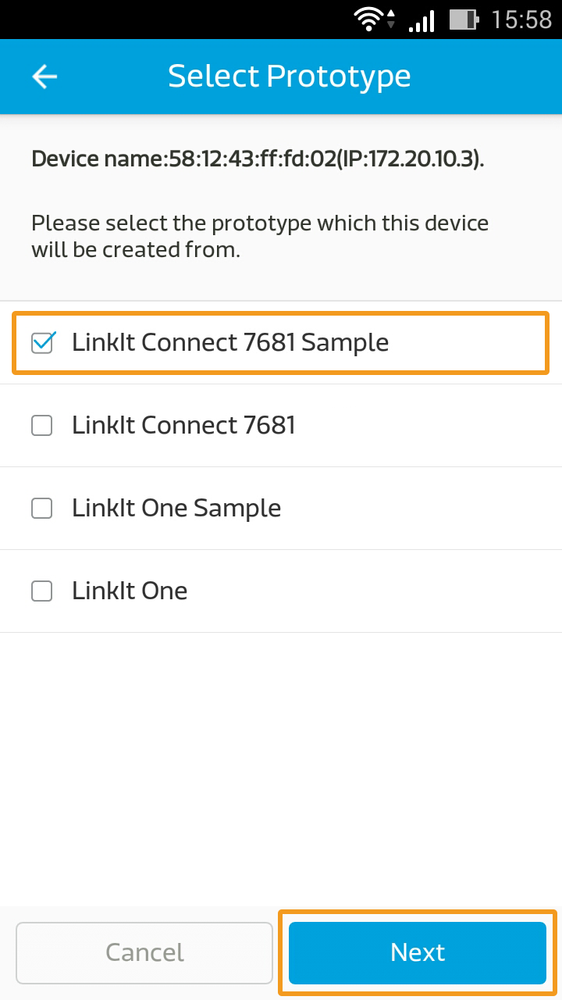
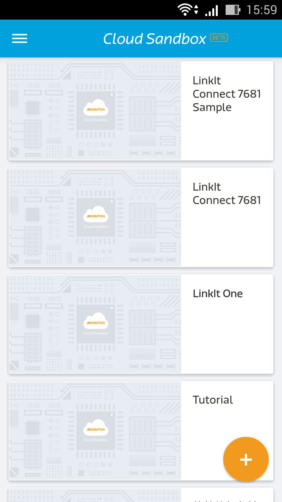

# LinkIt Connect 7681 Tutorial

# 1. Setup

The great thing about the Linkit Connect 7681 is that it requires almost no setup whatsoever to start connecting and utilizing MCS! There's no code or installation of any SDK to worry about. The board provides 1 UART port and 5 GPIO pins that each can implement PWM. Below is a list of those pins and their corresponding data channel IDs that can be used to connect to MCS:

**Data Channel ID Table**

|  | GPIO | PWM | UART |
| -- | -- | -- | -- |
| 00 | GPIO_00 | PWM_00 | UART |
| 01 | GPIO_01 | PWM_01 |
| 02 | GPIO_02 | PWM_02 |
| 03 | GPIO_03 | PWM_03 |
| 04 | GPIO_04 | PWM_04 |

Before you start, though, you're going to want a couple of things, including an **Android smartphone** that can access Wi-Fi, a **live Wi-Fi network** (and its **SSID** and **password**), a **micro-USB cord**, and a **laptop**.

a. Go ahead and **access the Google Play store** on your smartphone and **download the Mediatek Cloud Sandbox mobile application**, or simply **scan this QR code**:

b. Now, **plug the board to your laptop** via the micro-USB cord and set the board aside for now. You're not going to need it until the very end of this tutorial.

# 2. Create your prototype

The first step to take (beyond setting everything up) is to **set up your prototypes** with your GPIO, PWD, and UART data channels.

a. Click **Development** on the upper navigator, and click **Create** to make a new prototype.

b. Plop in whatever **name**, **prototype version**, and **industry** you'd like. However, make sure to select the **LinkIt Connect 7681 (MT7681)** option underneath the **Hardware Platform** dropdown list. Click **Save**.

c. Time to add your GPIO controllers! Click Detail.

d. Underneath **Data Channel**, click **Add**.

e. Click **Add** in the **Controller** box.

f. Again, fill in whatever **name** and **description** you'd like. Select **GPIO** as the data type, and fill out the **Data Channel ID** using the **Data Channel ID Table** at the top of this page. For the purpose of this tutorial, we've only included one GPIO controller, but you can add up to 4 more. (GPIO_01 to GPIO_04). Click **Save** after you create each controller.

g. Let's add in those PWD controllers. Repeat **steps 4 and 5** to open the **Add Data Channel** popup. Enter "PWM_00" as the Data Channel ID, and in **Data Channel Type**, select **PWM**. Click **Save** when you're all done. Again, we've only included 1 PWD controller, but you can add up to 4 more (PWD_01 to PWD_04)

h. Finally, let's include the UART type data channel. Repeat **steps 4 and 5**, and fill out "UART" as the data channel ID. Underneath **Data Channel Type**, select either **String** or **Hex**, depending on what you need.

# 3.  Connect your board to Wi-Fi

a. Let's connect that board of yours to Wi-Fi. Open up the **MCS mobile app**, and **sign in** with your details. After signing in, tap the **add icon** on the **bottom right corner**.

b. Hit Smart Connection, which spins up Mediatek **Smart Connection**. For more information, please see the MediaTek LinkIt Connect 7681 Developer’s Guide.

c. Enter your **SSID** and **password**, and hit **Start**.

d. **Wait a few seconds** for your device to pop up on the screen. If it doesn't, please first make sure that your **Wi-Fi is live** and that you are in an **area with good reception**, and then try again. Once your device is found, the app will immediately **jump back** to the "Add Devices" screen. If not, however, hit Cancel to return back to the "Add Devices" screen.

# 4.  Register a test device

a. Almost done; just need to register your LinkIt Connect 7681 to your MCS account. Hit the plus icon next to your Wi-Fi that you connected to in the previous section.

b. **Select the prototype you created earlier** from the list that appears.

c. Enter whatever name and description you'd like, and tap **Save**.

d. Your device list will refresh, now displaying the device you just registered, complete with the prototype you made and the data channels you added previously.

# 5.  Run it and go!

a. Now time for the easiest step! Just **tap on the device** you registered in the previous step.

b. You'll see a list of controllers that you added previously. **Switch** a GPIO controller from high to low, and the corresponding LED on your board should turn on. Isn't that cool?

**Just a note: when the GPIO is set to high, the LED is turned off. When the GPIO is set to low, the LED is turned on.**

